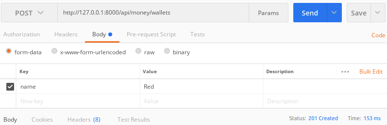
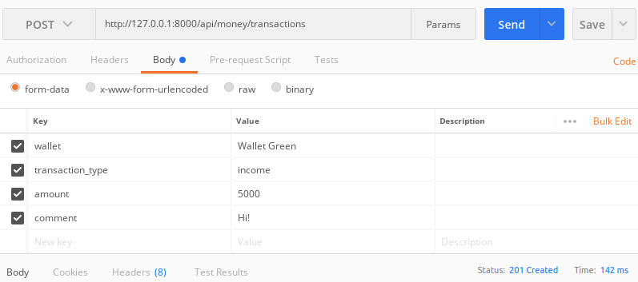

# Развертывание проекта

1. Клонирование проекта.

   ```bash
   git clone git@github.com:pavel-loginov-dev/ewallet.git
   ```

2. Внести секретный ключ (любой) в  ``.env_sample`` и изменить название на ``.env``.

   Например: ``SECRET_KEY=secretkey``.

3. Создать и активировать виртуальное окружение.

   ```bash
   virtualenv venv
   . venv/bin/activate
   ```

4. Установка зависимостей из файла ``requirements.base.txt``.

   ```bash
   pip install -r requirements.txt
   ```

5. Миграции.

   ```bash
   python manage.py makemigrations money
   python manage.py migrate
   ```

6. Запуск отладочного сервера.

   ```bash
   python manage.py runserver
   ```


# Особенности реализации

| Метод  | Адрес                         | Описание                                                     |
| ------ | ----------------------------- | ------------------------------------------------------------ |
| GET    | /api/money/wallets            | Список всех кошельков                                        |
| POST   | /api/money/wallets            | Создание кошелька                                            |
| PUT    | /api/money/wallets/:slug      | Обновление кошелька (доступ к кошельку по **slug**).<br>Слаг кошелька берется по имени ``"name": "Red W"`` -> ``"slug": "red-w"`` |
| DELETE | /api/money/wallets/:slug      | Удаление кошелька                                            |
| GET    | /api/money/transactions       | Список всех транзакций                                       |
| GET    | /api/money/transactions/:slug | Список всех транзакций для кошелька с указанным **slug**'ом. |
| DELETE | /api/money/transactions/:id   | Удаление транзакции по id                                    |
| POST   | /api/money/transactions       | Создание транзакции                                          |

При создании транзакции указывается 2 обязательных параметра: **name, transaction_type**.

​	**name** — название кошелька.

​	**transaction_type** — варианты "income" или "outcome" (пополнение/списание).

Также можно указать **amount** (сумма транзакции) и **comment** (комментарий пользователя).


Транзакция удаляется только если это возможно.

Пример, когда не удаляется, а выбрасывает исключение, что приводит к 400 Bad Request:

* Была произведена транзакция на пополнение кошелька.
  * +5000
* Далее было произведено несколько транзакций вывода.
  * -1000
  * -2500
* Удаление первой транзакции приведет к отрицательному балансу, т.к. баланс уже уменьшился.
  * Текущий баланс 1500. Удалить транзакцию пополнения на 5000 невозможно.


# Ручные тесты

В проекте есть некоторые тесты:

```
ewallet/ewallet/money/tests.py
```

```
ewallet/ewallet/money/api/tests.py
```


Здесь представлены ручные тесты, чтобы понять какие данные передаются и в каком виде.
Ручные тесты удобнее всего делать в [Postman](https://www.postman.com/), потому что много чего отключил в django и страницы DRF отрисовываются плохо.

## Запрос 1

**Method**: POST

**Body**: 

```json
{"name": "Red"}
```

**Request**:

```
http://127.0.0.1:8000/api/money/wallets
```




## Запрос 2

**Method**: POST

**Body**: 

```json
{"name": "Green"}
```

**Request**:

```
http://127.0.0.1:8000/api/money/wallets
```


## Запрос 3

**Method**: GET

**Request**:

```
http://127.0.0.1:8000/api/money/wallets
```

**Response:**

```json
[
    {
        "id": 1,
        "name": "Red",
        "slug": "red",
        "balance": 0
    },
    {
        "id": 2,
        "name": "Green",
        "slug": "green",
        "balance": 0
    }
]
```


## Запрос 4

**Method**: PUT

**Body**: 

```json
{"name": "Wallet Green"}
```

**Request**:

```
http://127.0.0.1:8000/api/money/wallets/green
```


## Запрос 5

**Method**: POST

**Body**: 

```json
{"wallet": "Wallet Green", "transaction_type": "income", "amount": 5000, "comment": "Hi!"}
```

**Request**:

```
http://127.0.0.1:8000/api/money/transactions
```




## Запрос 6

**Method**: POST

**Body**: 

```json
{"wallet": "Wallet Green", "transaction_type": "outcome", "amount": 2500}
```

**Request**:

```
http://127.0.0.1:8000/api/money/transactions
```


## Запрос 7

**Method**: POST

**Body**: 

```json
{"wallet": "Red", "transaction_type": "income", "amount": 100}
```

**Request**:

```
http://127.0.0.1:8000/api/money/transactions
```


## Запрос 8

**Method**: GET

**Request**:

```
http://127.0.0.1:8000/api/money/transactions
```

**Response:**

```json
[
    {
        "id": 1,
        "wallet": 2,
        "transaction_type": "income",
        "data": "2021-04-01T16:29:40.132449Z",
        "amount": 5000,
        "comment": "Hi!"
    },
    {
        "id": 2,
        "wallet": 2,
        "transaction_type": "outcome",
        "data": "2021-04-01T16:33:35.707518Z",
        "amount": 2500,
        "comment": ""
    },
    {
        "id": 3,
        "wallet": 1,
        "transaction_type": "income",
        "data": "2021-04-01T16:34:21.137547Z",
        "amount": 100,
        "comment": ""
    }
]
```


## Запрос 9

**Method**: GET

**Request**:

```
http://127.0.0.1:8000/api/money/transactions/red
```

**Response:**

```json
[
    {
        "id": 3,
        "wallet": 1,
        "transaction_type": "income",
        "data": "2021-04-01T16:34:21.137547Z",
        "amount": 100,
        "comment": ""
    }
]
```

## Run with docker-compose
```bash
make dev-up
```

## Shoutdown with docker-compose
```bash
make dev-down
```